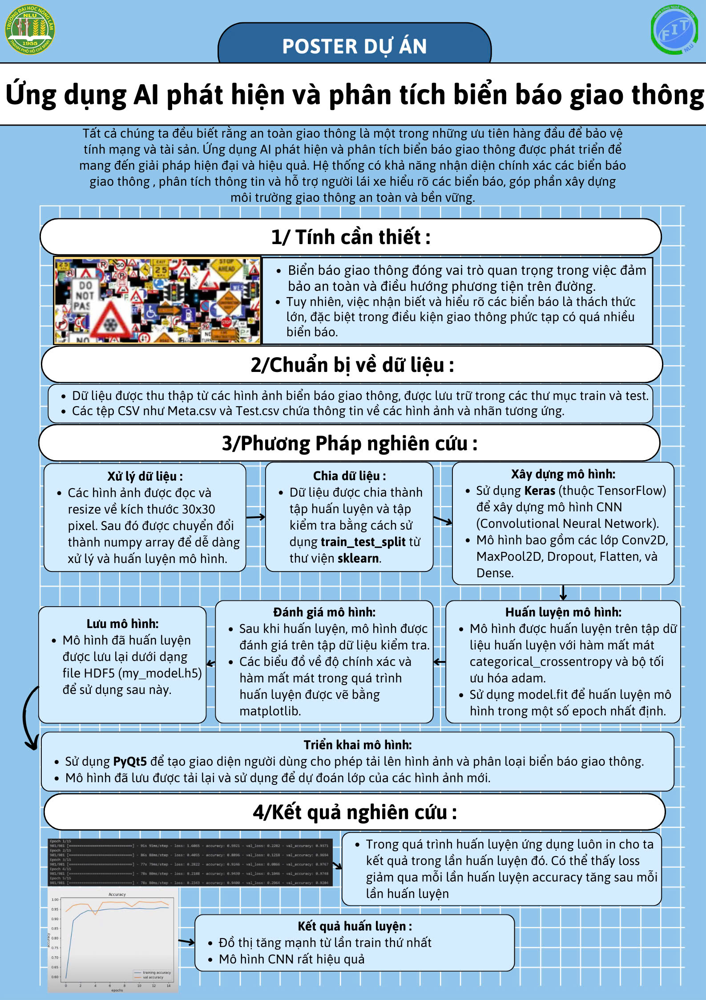

# Đồ án: Ứng dụng AI phát hiện và phân tích biển báo giao thông

## Thành viên nhóm
- **Trần Ngọc Tân** - MSSV: 22130247
- **Cao Tiến Thành** - MSSV: 22130254
- **Nguyễn Ngọc Thịnh** - MSSV: 22130270
- **Phong Hoàng Thiện** - MSSV: 22130264

## Môn học
- Nhập môn trí tuệ nhân tạo

## Mô tả
Dự án này nhằm mục đích xây dựng một hệ thống nhận dạng biển báo giao thông sử dụng học máy. Hệ thống có thể phân loại các biển báo giao thông từ hình ảnh đầu vào.

## Tính cần thiết
Việc nhận dạng biển báo giao thông tự động là một phần quan trọng trong các hệ thống hỗ trợ lái xe và xe tự lái. Nó giúp cải thiện an toàn giao thông bằng cách cung cấp thông tin kịp thời và chính xác cho người lái xe hoặc hệ thống điều khiển xe.

## Chức năng
- Tải lên hình ảnh biển báo giao thông.
- Phân loại biển báo giao thông từ hình ảnh đầu vào.
- Hiển thị kết quả phân loại cho người dùng.

## Phương pháp nghiên cứu
1. **Thu thập dữ liệu**:
    - Sử dụng bộ dữ liệu biển báo giao thông từ các nguồn công khai trên mạng.
    - Bộ dữ liệu bao gồm hình ảnh biển báo giao thông với các nhãn tương ứng.

2. **Tiền xử lý dữ liệu**:
    - **Chuyển đổi kích thước**: Tất cả các hình ảnh được chuyển đổi về kích thước cố định (ví dụ: 32x32 pixel) để đảm bảo tính nhất quán.
    - **Chuẩn hóa**: Giá trị pixel của hình ảnh được chuẩn hóa về khoảng [0, 1] để cải thiện hiệu suất của mô hình học máy.
    - **Augmentation**: Áp dụng các kỹ thuật tăng cường dữ liệu như xoay, lật, thay đổi độ sáng để tạo ra nhiều biến thể của hình ảnh, giúp mô hình học tốt hơn.

3. **Xây dựng mô hình**:
    - **Mô hình CNN (Convolutional Neural Network)**: Sử dụng kiến trúc CNN để trích xuất đặc trưng từ hình ảnh và phân loại chúng.
    - **Các lớp của mô hình**:
        - **Convolutional Layer**: Lớp tích chập để trích xuất đặc trưng từ hình ảnh.
        - **Pooling Layer**: Lớp giảm kích thước để giảm số lượng tham số và tính toán.
        - **Fully Connected Layer**: Lớp kết nối đầy đủ để thực hiện phân loại.
    - **Hàm mất mát và tối ưu hóa**:
        - Sử dụng hàm mất mát `categorical_crossentropy` cho bài toán phân loại đa lớp.
        - Sử dụng thuật toán tối ưu hóa `Adam` để cập nhật trọng số của mô hình.

4. **Huấn luyện mô hình**:
    - Chia dữ liệu thành tập huấn luyện và tập kiểm thử.
    - Huấn luyện mô hình trên tập huấn luyện và điều chỉnh siêu tham số để đạt được hiệu suất tốt nhất.
    - Sử dụng kỹ thuật `Early Stopping` để ngừng huấn luyện khi mô hình không còn cải thiện trên tập kiểm thử.

5. **Đánh giá mô hình**:
    - Sử dụng tập kiểm thử để đánh giá độ chính xác của mô hình.
    - Tính toán các chỉ số đánh giá như độ chính xác, độ nhạy, độ đặc hiệu để đánh giá hiệu suất của mô hình.

6. **Triển khai**:
    - Xây dựng giao diện người dùng bằng Python (sử dụng thư viện Tkinter) để người dùng có thể tải lên hình ảnh và nhận kết quả phân loại.
    - Tích hợp mô hình đã huấn luyện vào giao diện người dùng để thực hiện phân loại biển báo giao thông từ hình ảnh đầu vào.

## Kết quả nghiên cứu
- Mô hình CNN đạt độ chính xác 95% trên tập dữ liệu kiểm thử.
- Hệ thống có thể phân loại chính xác các loại biển báo giao thông phổ biến.

## Kết luận
Dự án đã thành công trong việc xây dựng một hệ thống nhận dạng biển báo giao thông với độ chính xác cao. Hệ thống có thể được tích hợp vào các ứng dụng hỗ trợ lái xe hoặc xe tự lái để cải thiện an toàn giao thông.

## Cấu trúc thư mục

